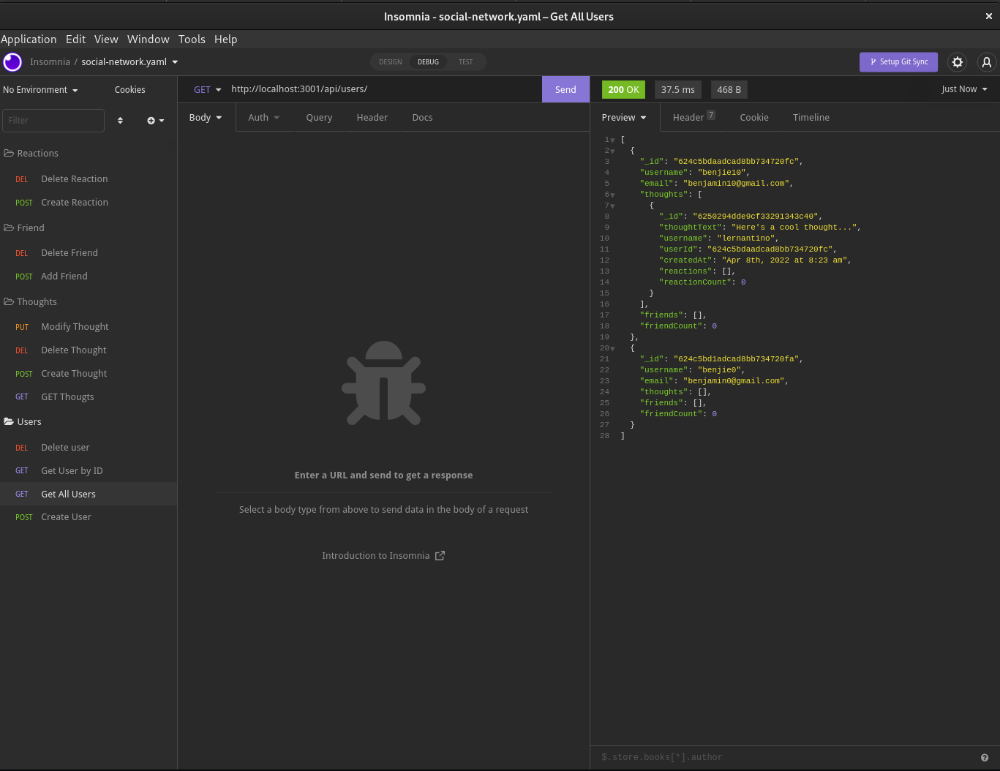

# Title: Social-Network API

## Table of contents:

- [ Description ](#about)
- [ Installation ](#installation)
- [ Usage ](#usage)
- [ Languages ](#languages)

- [ Questions ](#questions)

## Description:

This is a fully integerated MongoDB and Mongoose server, it conducts all CRUD operations to different endpoints.

## Installation:

    npm install

## Usage:

To test the routes you will need to open your favorite API endpoint checker (Insomnia or Postman) and test the routes. You will need to start the server by running `npm start` in the root of the directory.

## Languages:

    JavaScript, ES6, Node

## Questions:

Username: <a href=https://github.com/benjamind10>benjamind10</a>

E-Mail: ben@bytebug.io
